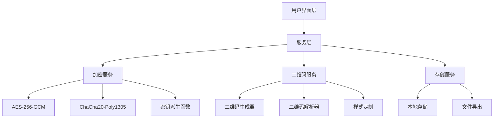

# 加密二维码功能设计文档

## 概述

加密二维码系统是一个具有隐蔽性的数据保护解决方案，允许用户将敏感信息安全地嵌入到看似普通的二维码中。系统采用双层保护机制：伪装层显示无害内容，加密层保护真实数据。只有拥有正确密码的用户才能访问隐藏的敏感信息。

## 架构

### 系统架构图



### 分层架构

1. **用户界面层 (UI Layer)**
   - 加密界面组件
   - 解密界面组件
   - 样式定制组件
   - 文件管理组件

2. **服务层 (Service Layer)**
   - 加密二维码服务 (EncryptedQRService)
   - 数据验证服务 (ValidationService)
   - 配置管理服务 (ConfigService)

3. **核心层 (Core Layer)**
   - 加密服务 (CryptoService)
   - 二维码服务 (QRCodeService)
   - 存储服务 (StorageService)

## 组件和接口

### 核心接口定义

```typescript
// 加密配置接口
interface EncryptionConfig {
  algorithm: 'AES-256-GCM' | 'ChaCha20-Poly1305';
  keyDerivation: 'PBKDF2' | 'Argon2';
  iterations: number;
  saltLength: number;
  ivLength: number;
}

// 二维码数据结构
interface EncryptedQRData {
  version: string;
  algorithm: string;
  salt: string;
  iv: string;
  ciphertext: string;
  tag?: string;
  disguise: string; // 伪装文本
}

// 加密请求接口
interface EncryptionRequest {
  plaintext: string;
  password: string;
  disguiseText: string;
  config: EncryptionConfig;
  qrStyle: QRStyleConfig;
}

// 解密请求接口
interface DecryptionRequest {
  qrData: string;
  password: string;
}
```

### 主要组件

#### 1. CryptoService (加密服务)

```typescript
class CryptoService {
  // 加密数据
  async encrypt(data: string, password: string, config: EncryptionConfig): Promise<EncryptedData>
  
  // 解密数据
  async decrypt(encryptedData: EncryptedData, password: string): Promise<string>
  
  // 密钥派生
  async deriveKey(password: string, salt: Uint8Array, config: EncryptionConfig): Promise<CryptoKey>
  
  // 生成随机数据
  generateSalt(length: number): Uint8Array
  generateIV(length: number): Uint8Array
}
```

#### 2. QRCodeService (二维码服务)

```typescript
class QRCodeService {
  // 生成二维码
  async generateQR(data: EncryptedQRData, style: QRStyleConfig): Promise<QRResult>
  
  // 解析二维码
  async parseQR(qrImage: File | string): Promise<EncryptedQRData>
  
  // 样式定制
  applyStyle(qrCode: QRCode, style: QRStyleConfig): QRCode
}
```

#### 3. EncryptedQRService (主服务)

```typescript
class EncryptedQRService {
  // 创建加密二维码
  async createEncryptedQR(request: EncryptionRequest): Promise<QRResult>
  
  // 解密二维码
  async decryptQR(request: DecryptionRequest): Promise<DecryptionResult>
  
  // 验证二维码格式
  validateQRData(data: EncryptedQRData): boolean
}
```

## 数据模型

### 加密数据结构

```typescript
// 内部加密数据结构
interface EncryptedData {
  algorithm: string;
  salt: Uint8Array;
  iv: Uint8Array;
  ciphertext: Uint8Array;
  tag?: Uint8Array; // 用于认证加密
}

// 二维码样式配置
interface QRStyleConfig {
  size: number;
  margin: number;
  colorDark: string;
  colorLight: string;
  logoUrl?: string;
  logoSize?: number;
  cornerStyle: 'square' | 'rounded' | 'dot';
  dotStyle: 'square' | 'rounded' | 'dot';
  errorCorrectionLevel: 'L' | 'M' | 'Q' | 'H';
}

// 导出结果
interface QRResult {
  qrCode: string; // Base64编码的图片
  format: 'PNG' | 'SVG' | 'PDF';
  metadata: {
    size: number;
    algorithm: string;
    created: Date;
  };
}
```

### 数据流转

1. **加密流程数据转换**
   ```
   用户输入 → 验证 → 加密 → 编码 → 二维码生成 → 文件输出
   ```

2. **解密流程数据转换**
   ```
   二维码输入 → 解析 → 验证 → 解密 → 完整性检查 → 结果显示
   ```

## 正确性属性

*属性是一个特征或行为，应该在系统的所有有效执行中保持为真——本质上是关于系统应该做什么的正式声明。属性作为人类可读规范和机器可验证正确性保证之间的桥梁。*
基于需求分析，以下是系统必须满足的核心正确性属性：

**属性 1: 加密解密往返一致性**
*对于任何* 明文数据和密码，加密后再用相同密码解密应该得到完全相同的原始数据
**验证需求: Requirements 2.2**

**属性 2: 相同数据不同密文**
*对于任何* 相同的明文数据和密码，多次加密应该产生不同的密文（由于随机IV）
**验证需求: Requirements 3.4**

**属性 3: 错误密码拒绝解密**
*对于任何* 加密二维码，使用错误密码尝试解密应该失败并返回错误
**验证需求: Requirements 2.3**

**属性 4: 二维码数据结构完整性**
*对于任何* 生成的加密二维码，解析后应该包含版本号、算法标识、盐值、IV和密文数据
**验证需求: Requirements 6.2**

**属性 5: 伪装文本显示**
*对于任何* 加密二维码，在未提供密码时应该只显示伪装文本而不是真实数据
**验证需求: Requirements 7.2**

**属性 6: 数据完整性验证**
*对于任何* 被篡改的加密数据，完整性验证应该检测到篡改并拒绝解密
**验证需求: Requirements 4.3**

**属性 7: 随机盐值唯一性**
*对于任何* 密钥派生操作，每次应该使用不同的随机盐值
**验证需求: Requirements 3.3**

**属性 8: Base64编码往返**
*对于任何* 二进制数据，Base64编码后解码应该得到原始数据
**验证需求: Requirements 6.5**

**属性 9: Logo嵌入不影响扫描**
*对于任何* 嵌入Logo的二维码，应该仍然能够被正确扫描和解析
**验证需求: Requirements 5.3**

**属性 10: 认证加密完整性保护**
*对于任何* 使用认证加密算法的数据，应该自动提供完整性保护
**验证需求: Requirements 4.4**

**属性 11: 防暴力破解时间成本**
*对于任何* 密码，密钥派生过程应该消耗至少3秒计算时间，使暴力破解不可行
**验证需求: Requirements 3.5**

**属性 12: 密码强度要求**
*对于任何* 用户输入的密码，系统应该验证其满足最低安全要求（12位+复杂度）
**验证需求: Requirements 1.4**

## 错误处理

### 错误类型定义

```typescript
enum EncryptedQRError {
  INVALID_PASSWORD = 'INVALID_PASSWORD',
  CORRUPTED_QR_DATA = 'CORRUPTED_QR_DATA',
  UNSUPPORTED_ALGORITHM = 'UNSUPPORTED_ALGORITHM',
  INTEGRITY_CHECK_FAILED = 'INTEGRITY_CHECK_FAILED',
  INVALID_QR_FORMAT = 'INVALID_QR_FORMAT',
  ENCRYPTION_FAILED = 'ENCRYPTION_FAILED',
  DECRYPTION_FAILED = 'DECRYPTION_FAILED',
  VERSION_INCOMPATIBLE = 'VERSION_INCOMPATIBLE'
}

interface ErrorResult {
  success: false;
  error: EncryptedQRError;
  message: string;
  details?: any;
}
```

### 错误处理策略

1. **输入验证错误**
   - 空密码或数据：立即拒绝并提示
   - 无效格式：提供格式要求说明
   - 文件类型错误：列出支持的格式

2. **加密/解密错误**
   - 密码错误：安全提示，不泄露具体信息
   - 算法不支持：提供支持的算法列表
   - 内存不足：建议减少数据大小

3. **完整性错误**
   - 数据篡改：警告用户并拒绝处理
   - 版本不兼容：提供升级建议
   - 格式损坏：建议重新生成

4. **系统错误**
   - 网络错误：提供重试选项
   - 存储错误：检查权限和空间
   - 未知错误：记录日志并提供联系方式

## 测试策略

### 双重测试方法

系统将采用单元测试和基于属性的测试相结合的方法：

**单元测试覆盖：**
- 特定算法的加密解密功能
- 用户界面组件的交互行为
- 错误处理的具体场景
- 文件导入导出功能
- 样式定制功能

**基于属性的测试覆盖：**
- 使用fast-check库进行属性测试
- 每个属性测试运行最少100次迭代
- 测试通用的正确性属性（如往返一致性）
- 验证安全属性（如随机性、完整性）
- 测试边界条件和异常情况

**测试配置要求：**
- 属性测试库：fast-check (JavaScript/TypeScript)
- 最小迭代次数：100次
- 每个属性测试必须标注对应的设计文档属性
- 标注格式：`**Feature: encrypted-qr-code, Property {number}: {property_text}**`

**测试数据生成策略：**
- 智能生成器：创建有效的加密配置、密码、文本数据
- 边界值测试：空字符串、超长数据、特殊字符
- 安全测试：弱密码、重复数据、恶意输入
- 性能测试：大文件、高频操作、并发访问

### 集成测试

- 端到端加密解密流程
- 多种算法兼容性测试
- 不同浏览器的二维码扫描
- 文件格式转换测试
- 用户界面完整流程测试

### 安全测试

- 密码强度验证
- 侧信道攻击防护
- 内存泄漏检测
- 随机数质量验证
- 时序攻击防护

## 性能考虑

### 加密性能优化

1. **算法选择**
   - AES-256-GCM：硬件加速支持
   - ChaCha20-Poly1305：软件实现高效
   - 根据设备能力自动选择

2. **密钥派生优化**
   - PBKDF2：兼容性好
   - Argon2：内存困难函数
   - 动态调整迭代次数

3. **数据处理优化**
   - 流式处理大文件
   - Web Workers异步加密
   - 内存使用优化

### 二维码生成优化

1. **渲染性能**
   - Canvas API硬件加速
   - SVG矢量图形优化
   - 批量生成优化

2. **存储优化**
   - 压缩算法选择
   - 缓存策略
   - 懒加载机制

## 安全考虑

### 密码学安全

1. **防暴力破解机制**
   - **高强度密钥派生**：Argon2id算法，内存成本64MB，时间成本3秒
   - **强制高迭代次数**：PBKDF2最少100,000次迭代，Argon2最少3次迭代
   - **密码强度要求**：最少12位，包含大小写字母、数字、特殊字符
   - **盐值长度**：32字节随机盐值，确保彩虹表攻击无效
   - **时间锁定机制**：连续失败3次后强制等待30秒
   - **计算成本**：单次密钥派生至少消耗3秒CPU时间

2. **加密算法安全性**
   - 使用经过验证的标准算法（AES-256-GCM、ChaCha20-Poly1305）
   - 256位密钥长度，理论破解时间超过宇宙年龄
   - 定期更新加密库
   - 支持算法升级迁移

3. **密钥管理安全**
   - 安全的密钥派生（强制高成本参数）
   - 内存中密钥保护（及时清零）
   - 及时清除敏感数据
   - 密钥不存储，每次重新派生

4. **随机数安全**
   - 使用密码学安全的随机数生成器（crypto.getRandomValues）
   - 足够的熵源（32字节盐值，16字节IV）
   - 随机性测试和验证

### 应用安全

1. **输入验证**
   - 严格的数据格式验证
   - 防止注入攻击
   - 文件类型检查

2. **错误处理安全**
   - 不泄露敏感信息的错误消息
   - 防止时序攻击
   - 安全的失败处理

3. **存储安全**
   - 本地存储加密
   - 临时文件清理
   - 权限控制

## MVP快速原型策略

### MVP核心功能范围

**第一阶段MVP（最小可用产品）：**
1. **基础加密解密**
   - 仅支持AES-256-GCM算法
   - 固定使用Argon2id密钥派生
   - 基础的密码强度验证

2. **简化二维码功能**
   - 基础黑白二维码生成
   - PNG格式输出
   - 固定大小和样式

3. **核心用户界面**
   - 加密页面：数据输入、密码设置、伪装文本
   - 解密页面：二维码上传、密码输入、结果显示
   - 基础错误提示

4. **防暴力破解核心**
   - Argon2id高成本参数（3秒计算时间）
   - 32字节随机盐值
   - 基础密码强度检查

**MVP技术栈简化：**
- 前端：React + TypeScript
- 加密库：Web Crypto API + argon2-browser
- 二维码：qrcode.js库
- 样式：Tailwind CSS（复用现有）

**MVP开发优先级：**
1. 核心加密解密逻辑（最高优先级）
2. 基础二维码生成解析
3. 简单用户界面
4. 基础测试覆盖
5. 防暴力破解验证

### MVP与完整版对比

| 功能 | MVP版本 | 完整版本 |
|------|---------|----------|
| 加密算法 | AES-256-GCM | AES-256-GCM + ChaCha20-Poly1305 |
| 密钥派生 | Argon2id | Argon2id + PBKDF2 |
| 二维码样式 | 基础黑白 | 完全自定义 |
| 输出格式 | PNG | PNG + SVG + PDF |
| 批量操作 | 不支持 | 支持 |
| Logo嵌入 | 不支持 | 支持 |
| 高级配置 | 固定参数 | 完全可配置 |

### MVP快速验证目标

**安全性验证：**
- 暴力破解测试：验证3秒计算成本
- 往返测试：加密解密一致性
- 随机性测试：盐值和IV唯一性

**用户体验验证：**
- 5秒内完成加密操作
- 直观的错误提示
- 伪装文本有效性

**技术可行性验证：**
- 浏览器兼容性测试
- 性能基准测试
- 内存使用监控

## 可扩展性设计

### 算法扩展

- 插件式算法架构
- 标准化算法接口
- 向后兼容性保证

### 功能扩展

- 模块化组件设计
- 事件驱动架构
- API标准化

### 平台扩展

- 跨平台兼容性
- 移动端适配
- 桌面应用支持