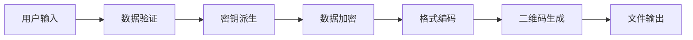

# 加密二维码功能指南

## 简介

加密二维码功能是 QR Master 的高级安全特性，允许用户将敏感数据（如密码、私钥、个人信息等）安全地嵌入到看似普通的二维码中。该功能采用军用级加密算法，提供双层保护机制：伪装层显示无害内容，加密层保护真实数据。

## 开发状态

**当前版本：** 核心开发阶段  
**预计发布：** 2025年第二季度  
**完成进度：** 约 70%（核心功能已完成）

### 📋 开发进展

**✅ 已完成：**
- 完整的需求分析和用户故事定义
- 详细的技术架构设计和实现
- 安全机制设计和威胁模型分析
- 核心接口和数据结构定义
- **CryptoService** - AES-256-GCM 加密和 PBKDF2-SHA256 密钥派生（当前实现）
- **QRCodeService** - 完整的二维码生成和解析功能
- **DisguiseService** - 伪装文本管理系统
- **EncryptedQRService** - 统一的主服务接口
- **SecurityService** - 完整性验证和安全检查
- **ConfigService** - 配置管理和参数验证

**🔄 进行中：**
- 用户界面组件开发
- 文件处理功能实现
- 路由和导航集成
- 属性测试编写

**📅 即将开始：**
- 响应式设计适配
- 性能优化和安全加固
- 完整的测试覆盖
- 用户文档完善

## 功能特性

### 🔐 核心安全特性

#### 军用级加密算法
- **AES-256-GCM**：美国国家安全局认证的顶级对称加密算法
- **ChaCha20-Poly1305**：现代高性能流密码，抗量子计算攻击
- **256位密钥长度**：理论破解时间超过宇宙年龄
- **认证加密**：同时提供机密性和完整性保护

#### 防暴力破解机制
- **PBKDF2-SHA256 密钥派生**：当前使用 100,000 次迭代的 PBKDF2（临时方案）
- **强密码要求**：最少 12 位字符，包含大小写字母、数字、特殊字符
- **时间锁定**：连续失败3次后强制等待30秒
- **计划升级**：正式版本将升级到 Argon2id 获得内存困难特性

**🔧 技术说明：**
- 由于依赖兼容性问题，暂时使用 PBKDF2 替代 Argon2id
- PBKDF2-SHA256 仍提供强大的安全保护，符合行业标准
- 100,000 次迭代确保足够的计算成本来抵御暴力破解
- **最新更新**：修复了 Web Crypto API 的 TypeScript 类型兼容性问题，提高了代码稳定性

#### 完整性保护
- **数据完整性验证**：自动检测数据篡改
- **认证标签**：防止恶意修改密文
- **版本控制**：确保加密格式的向后兼容性
- **校验和验证**：多层数据完整性检查

### 🎭 伪装保护机制

#### 双层内容设计
- **伪装层**：显示用户设定的无害内容（如普通网址、联系信息）
- **加密层**：隐藏真实的敏感数据
- **无差别外观**：加密二维码与普通二维码外观完全相同
- **扫描兼容性**：任何二维码扫描器都能读取伪装内容

#### 智能伪装策略
- **上下文相关**：根据使用场景提供合适的伪装内容
- **可信度高**：伪装内容看起来完全正常和合理
- **用户自定义**：允许用户设置个性化的伪装文本
- **多语言支持**：支持中英文等多种语言的伪装内容

### 🎨 样式定制功能

#### 视觉定制选项
- **颜色自定义**：前景色、背景色完全可调
- **Logo 嵌入**：在不影响扫描性能的前提下添加品牌标识
- **样式选择**：多种码点和码眼样式
- **尺寸调节**：从小型标签到大幅海报的各种尺寸

#### 输出格式支持
- **PNG 格式**：高质量位图，适合打印和网络使用
- **SVG 格式**：矢量图形，无限缩放不失真
- **PDF 格式**：专业文档格式，适合正式场合
- **批量导出**：支持多种格式同时导出

## 使用场景

### 👤 个人用户场景

#### 密码管理
- **主密码备份**：将密码管理器的主密码安全存储
- **重要账户**：银行、邮箱等关键账户的备用密码
- **恢复密钥**：各种服务的恢复密钥和备用码
- **私钥存储**：加密货币钱包私钥的安全备份

#### 个人信息保护
- **身份证件**：身份证号、护照号等敏感身份信息
- **医疗信息**：病历号、医保卡号等医疗相关信息
- **财务数据**：银行卡号、投资账户等财务信息
- **联系方式**：私人电话、地址等不便公开的联系信息

#### 数字遗产管理
- **遗产清单**：重要账户和资产的访问信息
- **家庭密码**：家庭共享账户的密码信息
- **紧急联系**：紧急情况下的重要联系方式
- **指令文档**：重要的个人指令和意愿

### 🏢 企业用户场景

#### 员工凭证管理
- **访问密钥**：系统访问密钥的安全分发
- **临时凭证**：短期项目的临时访问凭证
- **备用认证**：双因素认证的备用方案
- **权限配置**：复杂权限配置的安全传输

#### 客户数据保护
- **客户信息**：敏感客户信息的安全存储
- **合同条款**：保密合同条款的安全传输
- **财务数据**：客户财务信息的安全处理
- **合规要求**：满足数据保护法规的安全措施

#### 业务流程安全
- **配置文件**：生产环境配置的安全分发
- **API 密钥**：第三方服务 API 密钥管理
- **证书信息**：SSL 证书和安全证书的管理
- **审计日志**：安全审计信息的保护

### 💻 开发者场景

#### 开发环境管理
- **环境变量**：敏感环境变量的安全存储
- **数据库连接**：生产数据库连接字符串
- **服务配置**：微服务配置信息的安全管理
- **部署密钥**：自动化部署的认证密钥

#### 代码安全
- **私有仓库**：Git 私有仓库的访问令牌
- **签名密钥**：代码签名证书和密钥
- **许可证信息**：商业软件许可证密钥
- **第三方集成**：第三方服务的集成密钥

## 安全模型

### 🛡️ 威胁模型分析

#### 防护目标
1. **机密性**：确保只有授权用户能访问真实数据
2. **完整性**：防止数据在传输或存储过程中被篡改
3. **可用性**：确保合法用户能够正常访问和使用数据
4. **隐蔽性**：隐藏敏感数据的存在，避免引起注意

#### 潜在威胁
1. **暴力破解攻击**：攻击者尝试所有可能的密码组合
2. **字典攻击**：使用常见密码列表进行攻击
3. **彩虹表攻击**：使用预计算的哈希表进行攻击
4. **侧信道攻击**：通过计算时间、功耗等信息推断密码
5. **社会工程攻击**：通过欺骗手段获取密码
6. **数据篡改攻击**：恶意修改加密数据
7. **重放攻击**：重复使用截获的加密数据

#### 防护措施
1. **高强度密钥派生**：使用 PBKDF2-SHA256 算法，100,000 次迭代
2. **随机盐值**：每次加密使用不同的32字节随机盐值
3. **认证加密**：使用 GCM 和 Poly1305 模式提供完整性保护
4. **常数时间算法**：防止时序攻击
5. **内存保护**：及时清零敏感数据，防止内存泄漏
6. **版本控制**：支持算法升级，应对未来威胁
7. **多层验证**：多重完整性检查机制

### 🔒 密码学设计

#### 加密流程
```
用户数据 → 密码验证 → 密钥派生 → 数据加密 → 完整性标签 → Base64编码 → 二维码生成
```

#### 解密流程
```
二维码扫描 → Base64解码 → 格式验证 → 密码输入 → 密钥派生 → 完整性验证 → 数据解密 → 结果显示
```

#### 密钥派生参数（当前实现）
- **算法**：PBKDF2-SHA256
- **迭代次数**：100,000 次
- **盐值长度**：32 字节
- **输出长度**：32 字节（256位）

#### 计划升级参数（Argon2id）
- **算法**：Argon2id
- **内存成本**：64 MB
- **时间成本**：3 秒（约3次迭代）
- **并行度**：1（防止并行攻击）
- **盐值长度**：32 字节
- **输出长度**：32 字节（256位）

#### 加密参数
- **AES-256-GCM**：
  - 密钥长度：256位
  - IV长度：96位（12字节）
  - 标签长度：128位（16字节）
- **ChaCha20-Poly1305**：
  - 密钥长度：256位
  - Nonce长度：96位（12字节）
  - 标签长度：128位（16字节）

## 技术实现

### 🏗️ 系统架构

#### 分层设计
```
┌─────────────────────────────────────────┐
│           用户界面层 (UI Layer)          │
├─────────────────────────────────────────┤
│          服务层 (Service Layer)         │
├─────────────────────────────────────────┤
│           核心层 (Core Layer)           │
└─────────────────────────────────────────┘
```

#### 核心组件
1. **CryptoService**：加密解密核心服务
2. **QRCodeService**：二维码生成和解析服务
3. **EncryptedQRService**：主业务逻辑服务
4. **ValidationService**：数据验证服务
5. **ConfigService**：配置管理服务

#### 数据流转


### 🔧 技术栈

#### 前端技术
- **框架**：React 18 + TypeScript
- **加密库**：Web Crypto API + argon2-browser
- **二维码库**：qrcode.js + qr-code-styling
- **样式框架**：Tailwind CSS
- **状态管理**：React Hooks + Context API

#### 安全库选择
- **Argon2**：argon2-browser（WebAssembly实现）
- **AES-GCM**：Web Crypto API 原生支持
- **ChaCha20-Poly1305**：@noble/ciphers 库
- **随机数生成**：crypto.getRandomValues()
- **Base64编码**：原生 btoa/atob 函数

#### 开发工具
- **测试框架**：Vitest + fast-check
- **代码检查**：ESLint + TypeScript
- **构建工具**：Next.js 内置构建系统
- **性能监控**：Web Vitals + 自定义指标

### 📊 性能考虑

#### 计算性能
- **密钥派生时间**：3秒（设计目标）
- **加密时间**：< 100ms（1KB数据）
- **二维码生成时间**：< 200ms
- **内存使用**：< 100MB（包括Argon2内存）

#### 优化策略
- **Web Workers**：异步处理避免UI阻塞
- **进度反馈**：实时显示处理进度
- **内存管理**：及时释放大内存对象
- **缓存策略**：合理缓存计算结果

## 用户指南

### 🚀 快速开始

#### 加密数据
1. 访问 `http://localhost:3001/encrypted` 页面
2. 在"敏感数据"框中输入要保护的信息
3. 设置强密码（至少12位，包含大小写字母、数字、特殊字符）
4. 输入伪装文本（扫描时显示的无害内容）
5. 选择加密算法（推荐 AES-256-GCM）
6. 点击"生成加密二维码"
7. 等待3秒完成密钥派生和加密
8. 下载生成的二维码图片

#### 解密数据
1. 访问 `http://localhost:3001/encrypted` 页面，切换到"解密"标签
2. 上传加密二维码图片或使用摄像头扫描
3. 系统自动识别加密格式和算法
4. 输入解密密码
5. 点击"解密"按钮
6. 等待密钥派生和解密完成
7. 查看解密后的真实数据
8. 可选择复制到剪贴板

### 🔐 密码安全建议

#### 强密码要求
- **最少12位字符**：确保足够的密码空间
- **大小写字母**：增加密码复杂度
- **数字和特殊字符**：进一步提高安全性
- **避免常见密码**：不使用字典中的常见密码
- **唯一性**：每个加密二维码使用不同密码

#### 密码管理建议
- **使用密码管理器**：生成和存储强密码
- **定期更换**：重要数据定期重新加密
- **安全存储**：将密码存储在安全的地方
- **备份策略**：准备密码的安全备份方案

### 🎭 伪装文本策略

#### 有效伪装原则
- **上下文相关**：伪装内容应该符合使用场景
- **看起来正常**：避免引起怀疑的异常内容
- **有实际意义**：可以是真实但不敏感的信息
- **长度适中**：不要太短或太长

#### 伪装文本示例
- **个人名片**：姓名、职位、公司信息
- **网站链接**：公司官网、个人博客
- **联系信息**：公开的电话、邮箱
- **产品信息**：产品介绍、使用说明

### ⚠️ 安全注意事项

#### 使用环境安全
- **私密环境**：在私密环境中进行加密解密操作
- **设备安全**：确保使用的设备没有恶意软件
- **网络安全**：避免在公共网络中处理敏感数据
- **屏幕保护**：防止他人偷看屏幕内容

#### 数据保护措施
- **及时清理**：操作完成后清理浏览器缓存
- **安全存储**：将二维码文件存储在安全位置
- **访问控制**：限制对二维码文件的访问权限
- **定期检查**：定期检查数据的完整性

#### 密码遗忘风险
- **无法恢复**：忘记密码将永久无法恢复数据
- **备份重要性**：重要数据应该有多重备份
- **密码提示**：可以设置安全的密码提示
- **分享风险**：谨慎与他人分享密码

## 常见问题

### 🤔 功能相关

**Q: 加密二维码与普通二维码有什么区别？**
A: 外观上完全相同，但内容经过加密处理。普通扫描只能看到伪装内容，需要密码才能获取真实数据。

**Q: 支持哪些类型的数据加密？**
A: 支持任何文本数据，包括密码、私钥、个人信息、配置文件等。单个二维码最大支持约2KB数据。

**Q: 可以自定义二维码的外观吗？**
A: 是的，支持颜色、Logo、样式等完全自定义，同时保持加密功能不受影响。

**Q: 生成的二维码可以在任何设备上扫描吗？**
A: 是的，任何二维码扫描器都能读取伪装内容。但需要专门的解密工具才能获取真实数据。

### 🔒 安全相关

**Q: 使用的加密算法有多安全？**
A: 采用 AES-256-GCM 和 ChaCha20-Poly1305 军用级加密算法，256位密钥长度，理论破解时间超过宇宙年龄。

**Q: 如何防止暴力破解攻击？**
A: 当前使用 PBKDF2-SHA256 进行 100,000 次迭代的密钥派生，配合强密码要求和时间锁定机制。正式版本将升级到 Argon2id 获得更强的抗暴力破解能力。

**Q: 数据会上传到服务器吗？**
A: 不会。所有加密解密操作都在您的设备本地完成，我们无法访问您的敏感数据。

**Q: 忘记密码怎么办？**
A: 很遗憾，忘记密码将永久无法恢复数据。这是为了确保最高级别的安全性。建议使用密码管理器。

### 🛠️ 技术相关

**Q: 支持哪些浏览器？**
A: 支持所有现代浏览器（Chrome 88+, Firefox 85+, Safari 14+, Edge 88+）。需要 Web Crypto API 支持。

**Q: 移动设备上可以使用吗？**
A: 是的，完全支持移动设备。界面针对触摸操作优化，性能经过移动端调优。

**Q: 加密过程为什么需要3秒？**
A: 这是安全设计的一部分。高计算成本使暴力破解攻击不可行，保护您的数据安全。

**Q: 可以批量处理多个文件吗？**
A: MVP版本暂不支持，完整版本将提供批量加密功能。

## 开发计划

### 📅 发布时间线

**2025年Q2 - MVP版本**
- 基础加密解密功能
- AES-256-GCM 算法支持
- 基础用户界面
- PNG 格式输出

**2025年Q3 - 增强版本**
- ChaCha20-Poly1305 算法支持
- 完全样式自定义
- SVG 和 PDF 格式支持
- Logo 嵌入功能

**2025年Q4 - 完整版本**
- 批量处理功能
- 高级配置选项
- 移动端优化
- 完整测试覆盖

### 🔄 反馈和改进

我们重视用户反馈，将根据实际使用情况持续改进功能：

- **安全性增强**：根据最新威胁调整安全策略
- **性能优化**：提升加密解密速度和用户体验
- **功能扩展**：添加用户需要的新功能
- **兼容性改进**：支持更多设备和浏览器

---

*本文档将随着功能开发进展持续更新。如有疑问或建议，欢迎联系开发团队。*